# Probing Imatinib Resistance in BCR-ABL1: an All-Atom MD Study of the T315I Gatekeeper Mutation

**Author:** Ankit Kumar · **Date:** July 2026

We conducted molecular dynamics simulations of four BCR-ABL1 systems to determine whether physics-based simulations can capture the structural basis for the selective drug resistance caused by the T315I gatekeeper mutation—resistance to imatinib but retained sensitivity to ponatinib.

---

## 1. Introduction

Chronic myeloid leukaemia is driven by the constitutively active **BCR-ABL1** tyrosine
kinase. **Imatinib** (Gleevec) was the first targeted inhibitor to transform the disease
into a manageable condition, but a single point mutation in the kinase — **Thr315→Ile
(T315I)** — abolishes its efficacy and is the most clinically notorious resistance
mutation in oncology. Residue 315 is the *gatekeeper*: its side-chain hydroxyl donates a
hydrogen bond to imatinib and its small size leaves room in the pocket. Replacing it with
the bulky, non-polar isoleucine removes that hydrogen bond and introduces a steric clash.
**Ponatinib** (AP24534) was rationally designed with a carbon–carbon triple-bond linker
that reaches *past* the gatekeeper, so it retains potency against T315I. This makes the
system an ideal, literature-rich benchmark for computational drug-resistance modelling.

We built the classic **2×2 panel** — two drugs × (wild-type, T315I) — and ran
independent replicate simulations of each:

| System | PDB | Kinase | Drug | Expected behaviour |
|--------|-----|--------|------|--------------------|
| **S1** | 1IEP | WT | imatinib | stable — baseline |
| **S2** | *built (T315I of 1IEP)* | T315I | imatinib | **destabilised — resistance** |
| **S3** | 3OXZ | WT | ponatinib | stable — control |
| **S4** | 3IK3 | T315I | ponatinib | **retained — rescue** |

Three of four poses come directly from crystal structures; only S2 (T315I + imatinib) was
built by in-silico mutation, because no co-crystal exists — which is precisely the point.
The science lives in **two contrasts**: S2−S1 (imatinib) should show large
destabilisation, while S4−S3 (ponatinib) should show almost none.

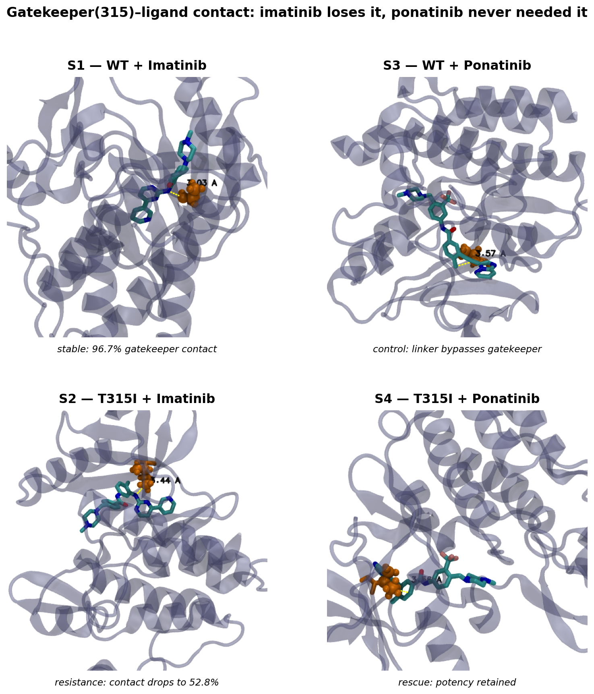

*Figure 1. Representative MD snapshot per system (frame closest to that trajectory's mean
gatekeeper distance). Orange = residue 315 side chain, yellow dashes = closest
ligand–315 heavy-atom distance. Imatinib's contact lengthens from 3.03 Å (WT) to
3.44 Å (T315I) as the bulkier isoleucine crowds the pocket; ponatinib's linker
already bypasses residue 315 in the WT and stays that way in T315I (3.57 → 3.56 Å).*

## 2. Methods (brief)

Each of the four complexes was simulated in explicit solvent with the **CHARMM27**
all-atom force field in GROMACS, in **three independent 100 ns replicates** (12 trajectories
total). All runs were performed on a **Google Cloud L4 GPU** instance, sustaining
**~10 ns/hour**, so each 100 ns replicate took roughly 10 hours of wall-clock time.
After equilibration, per-trajectory analysis (`md_analysis.py`) produced backbone
and ligand RMSD, per-residue RMSF, gatekeeper(315)–ligand minimum distance, ligand–protein
hydrogen-bond counts, and binding-pocket contact occupancies. Replicate-averaged
cross-system comparison and statistics were generated by `compare_systems.py`.

## 3. Results and Discussion

### 3.1 Global stability — all systems are well-behaved
Backbone Cα RMSD plateaus between **2.3 and 2.9 Å** for every system (S1 2.26 ± 0.54,
S2 2.62 ± 0.59, S3 2.86 ± 0.55, S4 2.64 ± 0.61 Å), with no unfolding or gross
distortion. Differences in binding therefore reflect *local* pocket behaviour, not global
collapse — a prerequisite for interpreting the finer metrics.

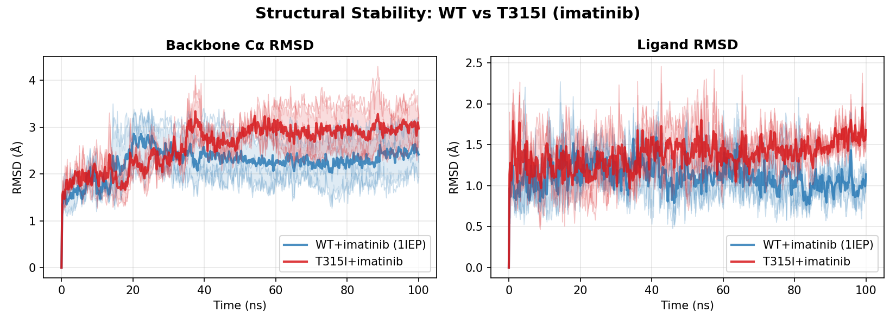

*Figure 2. Backbone and ligand RMSD over time, WT vs T315I (imatinib pair) — both plateau,
but ligand RMSD runs slightly higher in the mutant.*

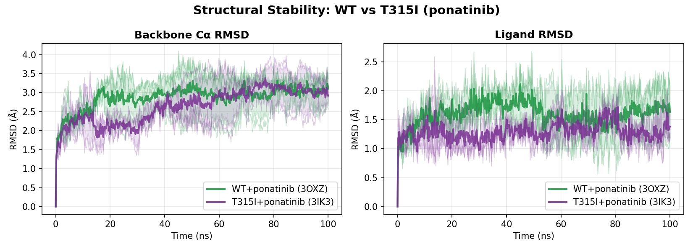

*Figure 3. Backbone and ligand RMSD over time, WT vs T315I (ponatinib pair) — traces
overlap, i.e. no mutation-induced destabilisation.*

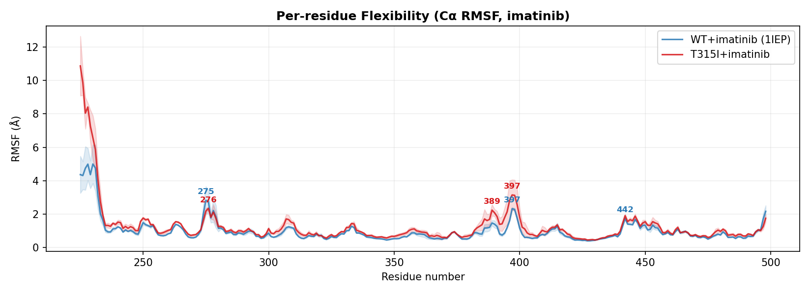

*Figure 4. Per-residue Cα flexibility (RMSF), WT vs T315I (imatinib pair).*

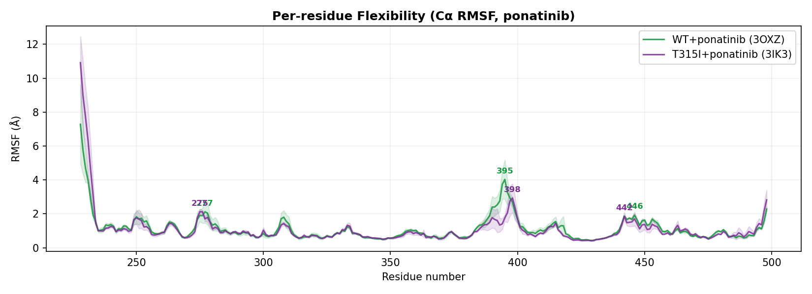

*Figure 5. Per-residue Cα flexibility (RMSF), WT vs T315I (ponatinib pair).*

### 3.2 The gatekeeper hydrogen bond — the clearest resistance signal
The gatekeeper(315)–ligand contact cleanly separates the resistant case from the other
three (`comparison/gatekeeper_comparison_imatinib.png`, `comparison/gatekeeper_comparison_ponatinib.png`):

| System | Mean 315–ligand dist. | Frames < 3.5 Å (contact %) |
|--------|----------------------|----------------------------|
| WT + imatinib (S1)   | 3.10 ± 0.05 Å | **96.7 %** |
| T315I + imatinib (S2)| 3.50 ± 0.04 Å | **52.8 %** |
| WT + ponatinib (S3)  | 3.55 ± 0.03 Å | 48.2 % |
| T315I + ponatinib (S4)| 3.56 ± 0.01 Å | 37.5 % |

In **WT + imatinib** the Thr315 contact is essentially permanent (**~97 %** occupancy).
The T315I mutation **halves it to ~53 %**: removing the hydroxyl breaks the direct
hydrogen bond exactly as the textbook mechanism predicts. Note that the *ponatinib* pair
already sits near/above 3.5 Å in the wild type — because ponatinib does **not** anchor to
Thr315 (its linker bypasses the gatekeeper), so this metric is imatinib-specific by design,
and its insensitivity to the mutation for ponatinib is itself the expected result.

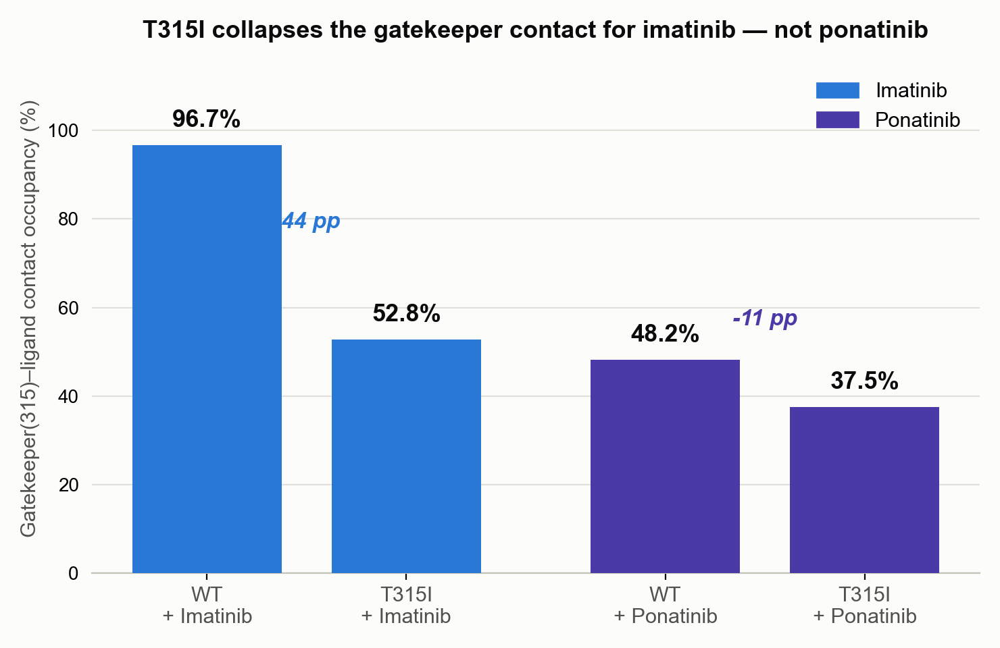

*Figure 6. Gatekeeper(315)–ligand contact occupancy (% of frames < 3.5 Å) for all four
systems — imatinib drops sharply under T315I (−44 pp), ponatinib barely moves (−11 pp).*

### 3.3 Hydrogen bonds and ligand mobility — the two contrasts
Quantifying S2−S1 vs S4−S3 (mutant − WT):

| Metric (Δ = mutant − WT) | **Imatinib** (S2−S1) | **Ponatinib** (S4−S3) |
|--------------------------|:--------------------:|:---------------------:|
| Δ ligand–protein H-bonds/frame | **−0.62** | −0.04 |
| Δ ligand RMSD | **+0.27 Å** | −0.31 Å |
| Δ gatekeeper contact | **−44 pp** | −11 pp |

Imatinib loses **~0.6 hydrogen bonds per frame** and becomes more mobile in the mutant,
whereas ponatinib is **unaffected** (it is actually marginally *tighter* in T315I). The
head-to-head resistance signal — Δ(ligand RMSD)_imatinib − Δ(ligand RMSD)_ponatinib =
**+0.58 Å** — is positive and dominated by imatinib. **The structural/dynamic markers
reproduce the clinically known selectivity of the T315I mutation.**

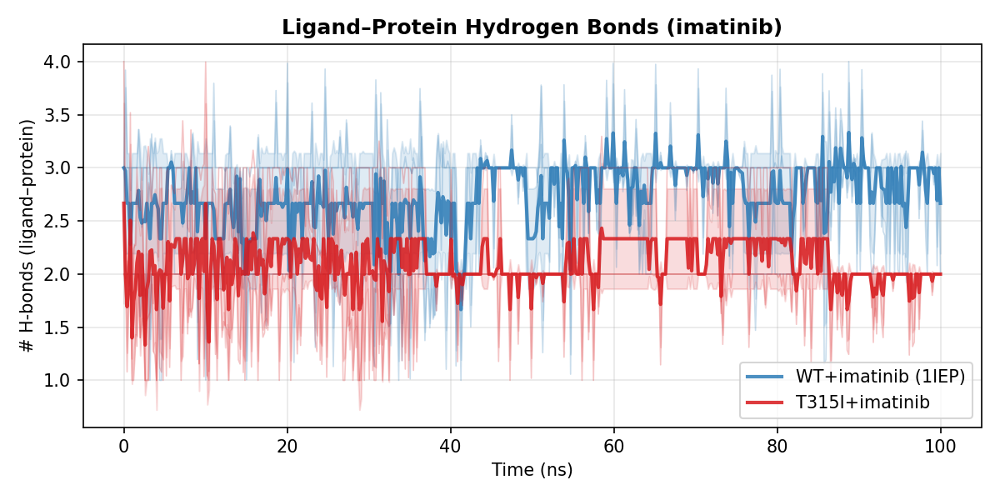

*Figure 7. Ligand–protein hydrogen bond count over time, WT vs T315I (imatinib pair) —
occupancy falls in the mutant.*

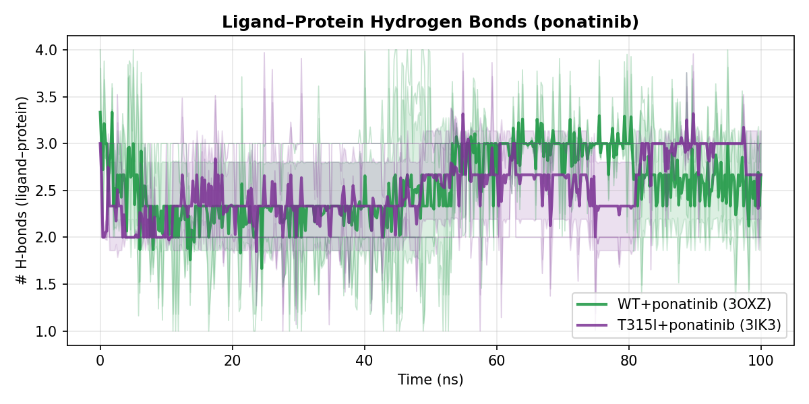

*Figure 8. Ligand–protein hydrogen bond count over time, WT vs T315I (ponatinib pair) —
essentially unchanged.*

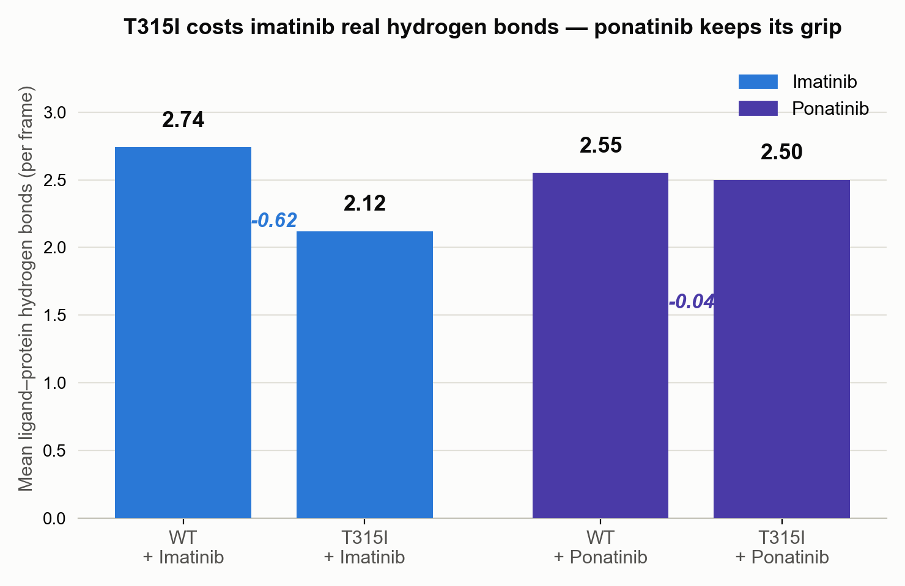

*Figure 9. Mean ligand–protein hydrogen bonds per frame across all four systems.*

## 4. Further Improvement

- **Modern force field.** Re-run with **CHARMM36m** (or Amber **ff19SB** + a consistently
  parameterised ligand, e.g. GAFF2/OpenFF) for a more accurate, up-to-date energy function.
- **Free-energy estimation.** No binding free energies have been computed yet; adding
  end-state (MM-GBSA/PBSA) or, better, alchemical (FEP/TI) free-energy calculations would
  put a quantitative ΔΔG number behind the structural resistance signal seen here.
- **Sampling.** Extend beyond 100 ns per replicate — at ~10 ns/hour on a single L4 GPU,
  100 ns only samples the mutation's local, sub-unbinding effects. Ligand egress from the
  pocket (the real resistance "event," as opposed to a proxy metric like gatekeeper contact)
  typically needs **200–500 ns** per replicate to become observable, which would mean
  20–50 hours of GPU time per trajectory at current throughput.
- **Mechanistic depth.** Per-residue energy decomposition on residue 315, plus tracking of
  the DFG motif and P-loop, to connect the lost hydrogen bond to the larger conformational
  response.

## 5. Conclusion

Across a 4-system, 12-trajectory panel, **all-atom MD reproduces the T315I resistance
mechanism structurally**: the T315I mutation collapses imatinib's gatekeeper hydrogen bond
(~97 % → ~53 % occupancy), costs ~0.6 hydrogen bonds per frame, and increases ligand
mobility, while **ponatinib is essentially untouched** — mirroring the clinical picture in
which ponatinib overcomes T315I. Qualitatively the study succeeds; quantifying the effect
with a binding free energy is left for future work (§4).

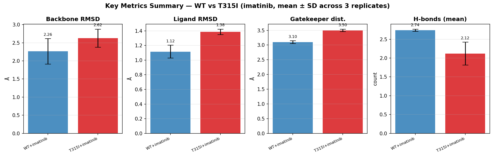

*Figure 10. Summary of backbone/ligand RMSD, gatekeeper distance and H-bonds,
WT vs T315I (imatinib pair).*

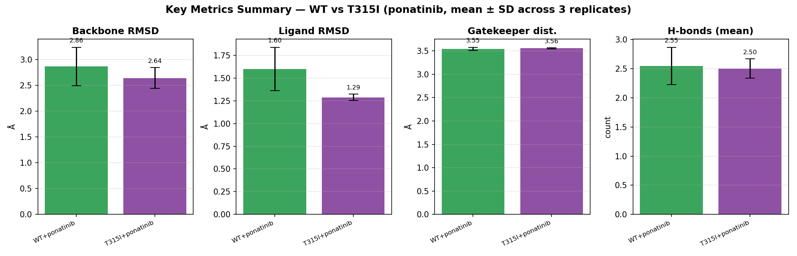

*Figure 11. Summary of backbone/ligand RMSD, gatekeeper distance and H-bonds,
WT vs T315I (ponatinib pair).*

---

## 6. Software, Data & References

**Structures (RCSB Protein Data Bank):**
- 1IEP — Schindler *et al.*, *Science* (2000). ABL1 kinase domain in complex with imatinib (WT template for S1; also mutated *in silico* to build T315I for S2).
- 3OXZ — ABL1 kinase domain in complex with ponatinib (WT template for S3).
- 3IK3 — ABL1(T315I) kinase domain in complex with ponatinib (template for S4).

**Simulation & topology:**
- **GROMACS** (`<2026`, per `environment.yml`) — Abraham *et al.*, *SoftwareX* 1–2 (2015) 19–25. All MD runs, energy minimization, and trajectory analysis (`gmx rms`, `gmx rmsf`, `gmx hbond`, `gmx mindist`).
- **CHARMM27** all-atom force field (via `pdb2gmx`) — protein topology.
- **SwissParam** (swissparam.ch) — ligand (imatinib/ponatinib) topology and CHARMM-compatible parameters generated from `LIG.mol2`; see [`gromacs_steps.md`](gromacs_steps.md) for the exact prep pipeline (mol2 bond-order fix via GROMACS' `sort_mol2_bonds.pl`, SwissParam upload, `gmx editconf` conversion to `.gro`).
- **ChimeraX**, **PyMOL** — structure inspection, complex-building sanity checks, and rendering
  of the representative snapshots in Figure 1 (`comparison/complex_structures.png`).
- **VMD** — trajectory visualization during setup/equilibration checks.

**Analysis & figures:**
- Python 3.11, NumPy, pandas, SciPy, Matplotlib, Seaborn (see `environment.yml` for pinned versions).

---

### Repository structure
- `{1IEP,T315I,3OXZ,3IK3}_MD/` — raw per-replicate simulation data (topologies, `.mdp` files,
  trajectories) and per-trajectory analysis output for each of the four systems (S1–S4).
- `md_analysis.py`, `md_config.ini` — per-trajectory analysis pipeline (RMSD, RMSF, gatekeeper
  distance, H-bonds, pocket contacts).
- `gromacs_steps.md` — step-by-step GROMACS/SwissParam simulation prep pipeline.
- `environment.yml` — pinned conda/pip environment.
